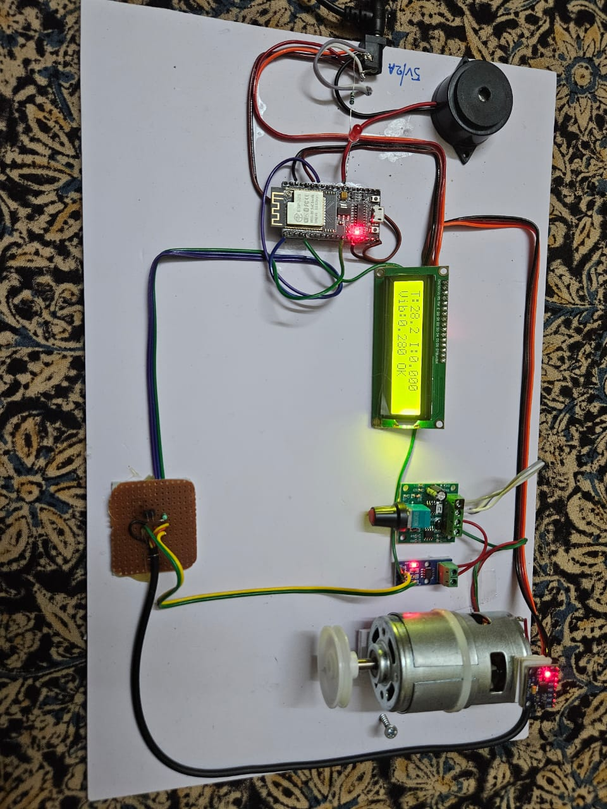
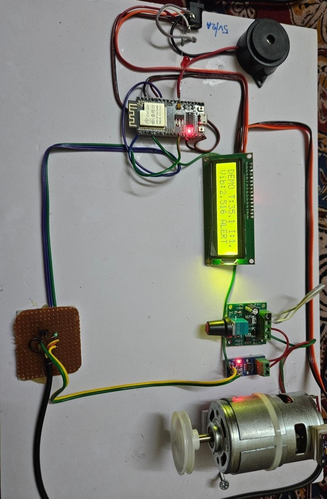
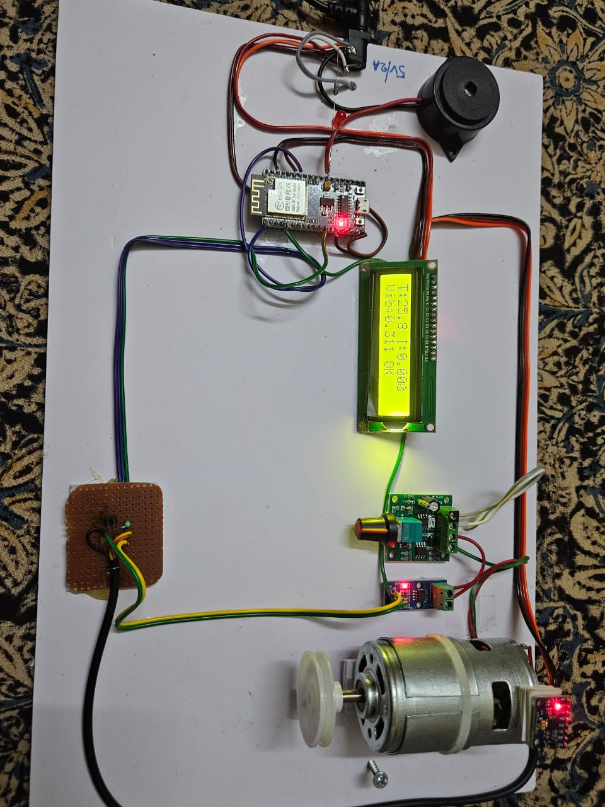
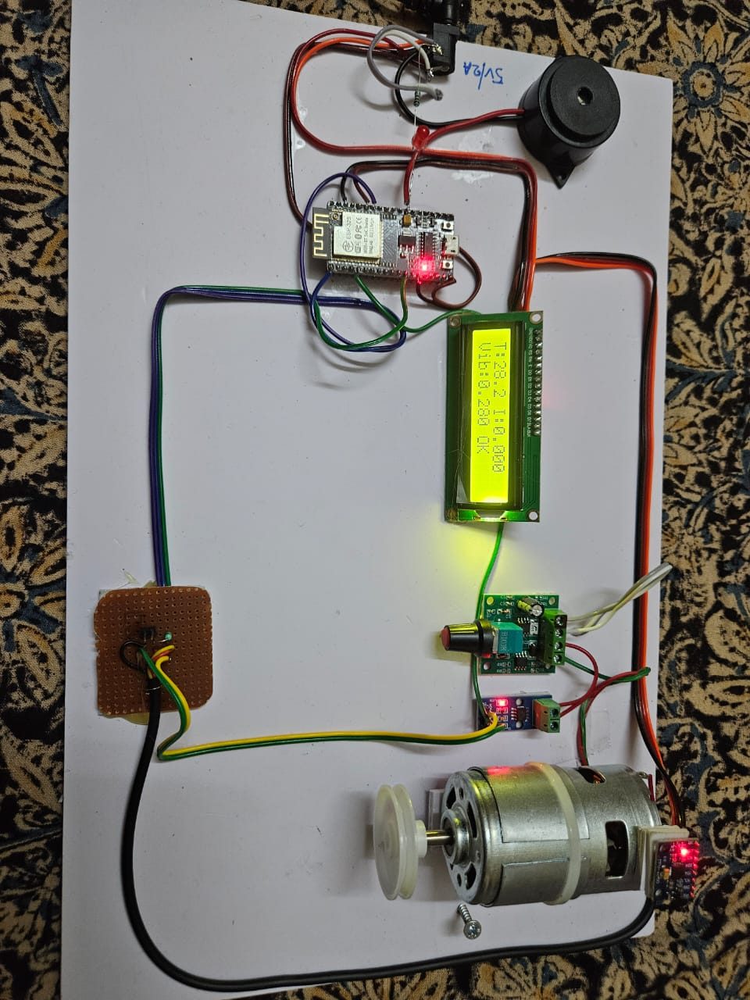
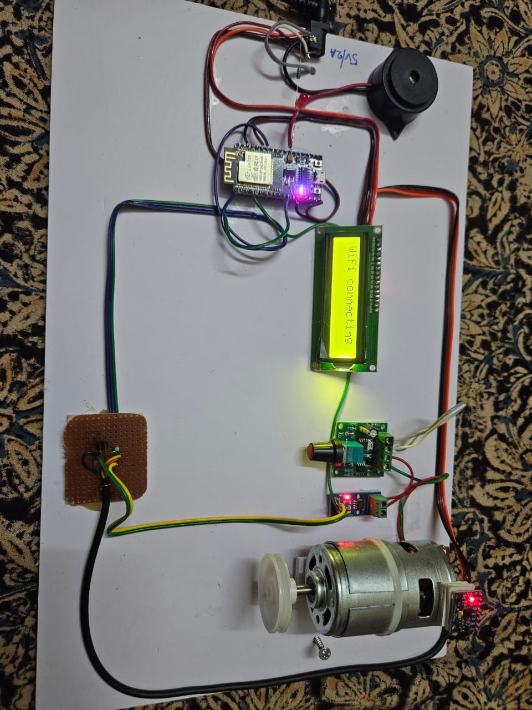
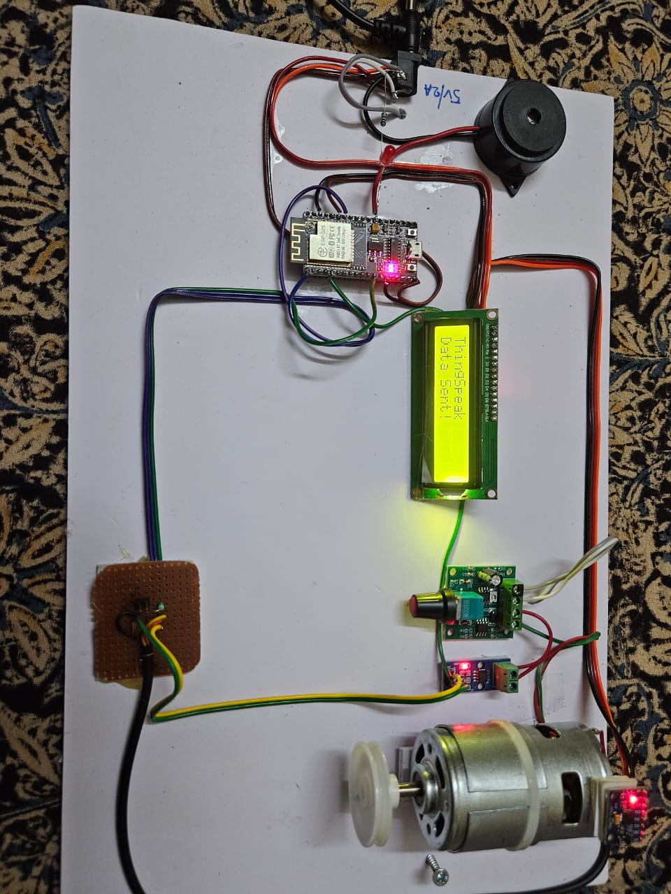

# Federated-Learning-Based-Predictive-Maintenance-System-for-Industrial-Machinery
•Designed a predictive maintenance framework using LSTM networks and Federated Learning to analyze industrial sensor data for early fault detection and equipment health prediction.
•Implemented adaptive hyperparameter optimization and real-time anomaly detection to improve prediction accuracy and reduce unexpected machinery downtime.
•Developed cloud-integrated monitoring dashboards with secure IoT communication for remote industrial asset monitoring and Industry 4.0 applications.
<div align="center">

# 🏭 Federated Learning-Based Predictive Maintenance System
### for Industrial Machinery


</div>

---

## 📸 Screenshots

<div align="center">

  

  

  

  

  

  

  


</div>

---

## 🧠 Overview

A privacy-preserving **Predictive Maintenance System** combining **LSTM networks** and **Federated Learning** to analyze industrial sensor data for early fault detection and equipment health prediction — without centralizing sensitive industrial data.

- Reduces unexpected machinery downtime through real-time anomaly detection
- Adaptive hyperparameter optimization improves prediction accuracy
- Cloud-integrated dashboards for remote industrial asset monitoring
- Built for **Industry 4.0** applications with secure IoT communication

---

## ⚙️ Features

- **Federated Learning** — decentralized model training across industrial nodes
- **LSTM-based fault detection** — time-series sensor data analysis
- **Adaptive hyperparameter optimization** — automated model tuning
- **Real-time anomaly detection** — early equipment failure warnings
- **Cloud monitoring dashboard** — remote asset health visualization
- **Secure IoT communication** — encrypted data transmission

---

## 🛠️ Tech Stack


---

## 🏗️ System Architecture

```
Industrial Sensors (IoT)
        │
        ▼
Local LSTM Models (Federated Nodes)
        │
        ▼ Federated Aggregation
Global Model (No raw data shared)
        │
        ▼
Cloud Monitoring Dashboard
        │
        ├── Real-time anomaly alerts
        ├── Equipment health prediction
        └── Maintenance scheduling
```

---

## 🚀 How to Run

### 1. Clone the repo
```bash
git clone https://github.com/sanjay10code/Federated-Learning-Based-Predictive-Maintenance-System-for-Industrial-Machinery
cd Federated-Learning-Based-Predictive-Maintenance-System-for-Industrial-Machinery
```

### 2. Install dependencies
```bash
pip install tensorflow keras flask pandas numpy scikit-learn joblib
```

### 3. Train the model
```bash
cd Model
jupyter notebook Machine_function.ipynb
```

### 4. Run the Flask app
```bash
cd Implementation
python app.py
```

### 5. Open in browser
```
http://localhost:5000
```

---
